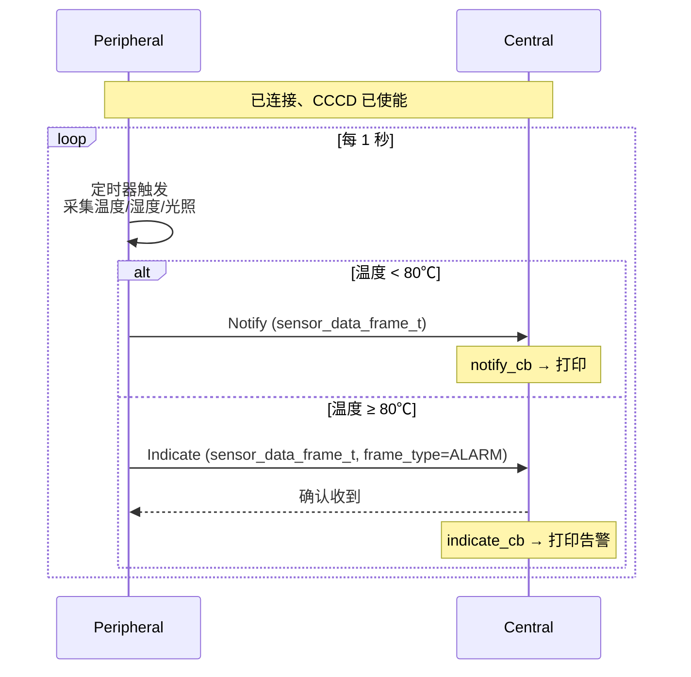

# 传感器上报

> BLE (Bluetooth Low Energy) GATT (Generic Attribute Profile) Notify/Indicate、定时器、数据格式设计

> 前置阅读：[Hello Notify](../basics/hello-notify.md)

## 学习目标

- 掌握 Peripheral 端用定时器驱动 BLE Notify 周期性发送传感器数据
- 理解 BLE Notify vs Indicate 的选择依据
- 掌握多传感器数据格式设计（结构体 vs TLV (Tag-Length-Value)）
- 能够在真实传感器上对接 BLE 上报

## 规格与功能

Peripheral 每 1 秒采集 3 路模拟传感器数据（温度/湿度/光照），通过 BLE Notify 推送。温度超过 80℃ 时用 Indicate 发送告警。

| 规格项 | 说明 |
|--------|------|
| 上报间隔 | 1 秒 |
| 传感器 | 温度（×100）、湿度（0~100%）、光照（lux） |
| 常规数据 | Notify（无需确认） |
| 告警数据 | Indicate（需确认） |

## 基本概念

### BLE Notify vs Indicate

| | Notify | Indicate |
|:---|:---|:---|
| 确认 | 无 | Central 必须确认 |
| 速度 | 快 | 慢（等确认往返） |
| 适用 | 常规数据上报 | 告警/关键配置变更 |
| 下一包发送 | 随时可发 | 等确认后才能发下一包 |

与 SLE (SparkLink Low Energy) 对比：SLE 用双 Property 区分 Notify/Indicate（CCCD (Client Characteristic Configuration Descriptor) 互斥），BLE 用不同的 Characteristic Property 声明（同一 Characteristic 可同时声明 NOTIFY 和 INDICATE，但 CCCD 决定当前使用的模式）。

### 通信流程



## 涉及 API

| API | 谁调用 | 用途 |
|-----|--------|------|
| `gatts_notify()` | Peripheral | 发送 Notify |
| `gatts_indicate()` | Peripheral | 发送 Indicate |
| `osal_timer_init/start` | Peripheral | 定时器驱动上报 |

## 案例操作指导


Central 串口每秒打印：`[T=0s] temp=25.3C, hum=62%, light=1200lux`。温度超 80℃ 时打印 `** ALARM **`。

## 关键配置

- 上报间隔：1 秒
- Characteristic Property：`NOTIFY | INDICATE`
- 传感器数据帧结构体：`frame_type + sensor_count + timestamp + temperature + humidity + light`（12 字节）

## 代码详解

### 定时器驱动的上报循环

```c
static void sensor_report_timer_cb(unsigned long arg)
{
    (void)arg;
    if (g_conn_id == 0) return;  // 未连接

    sensor_data_frame_t frame = {0};
    frame.temperature = read_temperature();
    frame.humidity    = read_humidity();
    frame.light       = read_light();
    frame.timestamp   = get_timestamp_ms();

    if (frame.temperature > ALARM_THRESHOLD) {
        frame.frame_type = FRAME_TYPE_ALARM;
        gatts_indicate(g_conn_id, g_sensor_char_handle,
                                (uint8_t *)&frame, sizeof(frame));
    } else {
        frame.frame_type = FRAME_TYPE_NORMAL;
        gatts_notify(g_conn_id, g_sensor_char_handle,
                              (uint8_t *)&frame, sizeof(frame));
    }
}
```

### 适配真实传感器

示例中 `read_temperature()` 等为模拟生成函数。适配真实传感器时，只替换这三个函数实现，保持帧结构体和上报逻辑不动。数据值范围需与帧结构体字段一致（温度 ×100、湿度 0~100、光照 0~65535）。

### 扩展更多传感器

当传感器数量 > 5 个或类型动态变化时，从固定结构体切换到 TLV 格式。参见 OS (Operating System) 内存管理中的 TLV 编解码示例。

---

