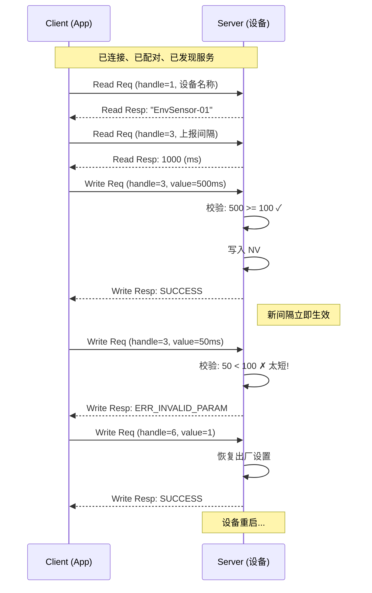

# 设备配置

> SLE (SparkLink Low Energy) SSAP (SLE Service Access Protocol) 属性读写、设备参数规划、持久化存储

> 本页是通用配置协议的基础说明，负责属性布局、输入校验、错误响应和持久化边界。具体 Wi-Fi SSID/密码协议与入网流程见 [Wi-Fi 配网](../verticals/wifi-config.md)。

> 前置阅读：[属性读写（Read/Write）](../basics/hello-readwrite.md)

## 学习目标

- 理解设备参数配置与简单属性读写的区别：配置需要设计属性布局、校验、持久化
- 掌握将多个设备参数映射到 SSAP 属性的规划方法
- 掌握 Server 端校验写入数据的合法性和生效逻辑
- 理解只读、可读写、可写不可读三种权限在实际配置场景中的运用
- 能够在 hello-readwrite 的基础上，实现 App 对设备的完整参数配置

## 规格与功能

本案例在 hello-readwrite 基础上，实现一个完整的设备参数配置功能——这是所有可配置 IoT 设备的通用模式。

| 规格项 | Server 端 | Client 端 |
|--------|----------|----------|
| 连接与配对 | 继承 hello-connect + hello-readwrite 流程 | 同 Server |
| 可读属性 | 设备名称、固件版本、序列号（只读） | 读取并显示 |
| 可读写属性 | 上报间隔、告警阈值、设备模式（可读写） | 读取当前值、写入新值 |
| 数据校验 | 拒绝非法值（间隔 < 100ms、阈值超范围） | 收到拒绝时提示用户 |
| 持久化 | 配置写入后保存到 NV (Non-Volatile)| — |
| 生效策略 | 部分参数立即生效，部分需重启 | — |

程序运行流程：

1. Client 连接 Server 后，完成配对和 MTU (Maximum Transmission Unit) 协商
2. Client 发现服务结构，拿到各 Property 的 handle
3. Client 先读取设备名称、固件版本等固定信息
4. Client 读取当前上报间隔和告警阈值
5. 用户修改上报间隔 → Client 发起 Write Request → Server 校验合法性 → 写入 NV   → 返回成功
6. 用户修改超出范围的值 → Server 校验失败 → 返回错误码

> hello-readwrite 教你"怎么读和写"，本篇教你"设计一个设备有哪些可配置属性以及怎么写对"。

## 基本概念

### 典型使用场景

任何需要远程管理和配置的 IoT 设备，都会涉及设备参数配置。与传感器上报（数据从设备流向 App）不同，配置是 App 流向设备的指令。例如：

- **智能灯控**：App 配置灯的亮度、色温、定时开关时间
- **环境传感器**：App 配置上报间隔、告警阈值、传感器使能
- **工业网关**：App 配置采样率、滤波参数、RS485 (Recommended Standard 485) 从站地址
- **穿戴设备**：App 配置心率监测频率、屏幕亮度、振动强度

### 属性分类与权限设计

一个设计良好的设备配置方案，应该将属性按用途和权限分类：

| 类型 | 权限 | 说明 | 示例 |
|------|------|------|------|
| **设备信息** | 只读 | 出厂固化的标识信息，不允许修改 | 固件版本、序列号、MAC (Media Access Control) 地址 |
| **运行状态** | 只读 | 运行时动态变化的值，只可观测 | CPU 温度、信号强度、电池电量 |
| **可配置参数** | 可读写 | 用户可修改的参数，需校验范围 | 上报间隔、告警阈值、设备名称 |
| **控制指令** | 只写 | 触发某个动作，不存储值 | 重启、恢复出厂设置、立即上报 |

```text
Service (UUID: 0x5000)
│
├── Property 1  handle=1  权限: READ        设备名称   "EnvSensor-01"
├── Property 2  handle=2  权限: READ        固件版本   "v1.0.0"
├── Property 3  handle=3  权限: READ|WRITE  上报间隔   1000ms
├── Property 4  handle=4  权限: READ|WRITE  告警阈值   80℃
├── Property 5  handle=5  权限: READ|WRITE  设备模式   0=正常, 1=低功耗
└── Property 6  handle=6  权限: WRITE       恢复出厂   写 1 触发
```

### 通信流程：配置读写



### 数据校验的重要性

Client 写配置值时，Server **不能无条件信任**。必须校验：

1. **范围校验**：值是否在允许范围内（如上报间隔 ≥ 100ms）
2. **类型校验**：值的数据类型是否匹配（如期望 uint16_t，收到的是否为 2 字节）
3. **逻辑校验**：多个参数之间是否冲突（如低功耗模式 + 上报间隔 100ms 矛盾）
4. **权限校验**：是否试图写只读属性（协议栈会自动拦截，Server 回调不会触发）

> 校验失败的写入必须返回明确的错误码，帮助 App 端定位问题。不要静默忽略——这会让开发者困惑为什么配置不生效。

## 涉及 API

本案例在 hello-readwrite 的 API 基础上新增属性布局规划和 NV 存储相关 API：

| API | 谁调用 | 用途 |
|-----|--------|------|
| `ssapc_read_req()` | Client | 发起属性读请求（hello-readwrite 中已介绍） |
| `ssapc_write_req()` | Client | 发起属性写请求（hello-readwrite 中已介绍） |
| `ssaps_read_response()` | Server | 回复读请求（hello-readwrite 中已介绍） |
| `ssaps_write_response()` | Server | 回复写请求（hello-readwrite 中已介绍） |
| `ssaps_add_property_sync()` | Server | 添加属性，配置权限和操作指示位（hello-notify 中已介绍） |
| `uapi_nv_write()` | Server | 将配置值写入 NV（Flash 持久化） |
| `uapi_nv_read()` | Server | 从 NV 读取已保存的配置值 |

## 案例说明

### 案例简介

实现一个设备配置方案：Server 端暴露 6 个 Property，包含设备信息（只读）、运行参数（可读写）、控制指令（只写）。Client 端通过标准的 Read/Write Request 读取信息和修改配置。

### 属性布局

| Handle | 名称 | 权限 | 数据类型 | 默认值 | 校验规则 |
|:---:|------|:---:|------|------|------|
| 1 | 设备名称 | R | string[16] | "EnvSensor-01" | — |
| 2 | 固件版本 | R | string[8] | "v1.0.0" | — |
| 3 | 上报间隔 | R/W | uint16_t (ms) | 1000 | 100 ~ 60000 |
| 4 | 告警阈值 | R/W | int16_t (×10℃) | 800 | -200 ~ 1000 |
| 5 | 设备模式 | R/W | uint8_t | 0 | 0=正常, 1=低功耗 |
| 6 | 恢复出厂 | W | uint8_t | — | 写 1 触发 |

> 属性布局是设备端最重要的设计决策之一。新增属性时只追加不修改已有 handle 编号，保证新旧固件兼容。

## 关键配置

### 属性权限与操作指示配置

每个 Property 的权限和操作指示决定它的行为：

```c
// Property 1: 设备名称 — 只读
#define DEV_NAME_PERMISSIONS    SSAP_PERMISSION_READ
#define DEV_NAME_OP_IND         SSAP_OPERATE_INDICATION_BIT_READ

// Property 3: 上报间隔 — 可读写
#define REPORT_INTERVAL_PERMISSIONS  (SSAP_PERMISSION_READ | SSAP_PERMISSION_WRITE)
#define REPORT_INTERVAL_OP_IND       (SSAP_OPERATE_INDICATION_BIT_READ | \
                                      SSAP_OPERATE_INDICATION_BIT_WRITE)

// Property 6: 恢复出厂 — 只写
#define FACTORY_RESET_PERMISSIONS    SSAP_PERMISSION_WRITE
#define FACTORY_RESET_OP_IND         SSAP_OPERATE_INDICATION_BIT_WRITE
```

### 配置持久化

```c
// 设备配置的 NV 存储结构
#define NV_ITEM_DEVICE_NAME       0x01
#define NV_ITEM_REPORT_INTERVAL   0x03
#define NV_ITEM_ALARM_THRESHOLD   0x04
#define NV_ITEM_DEVICE_MODE       0x05

// 上电时从 NV 读取已保存的配置
static void load_config_from_nv(void)
{
    uint16_t interval;
    if (uapi_nv_read(NV_ITEM_REPORT_INTERVAL, &interval, 2) == ERRCODE_SUCC) {
        g_device_config.report_interval = interval;
    } else {
        // NV 中无数据，使用默认值
        g_device_config.report_interval = 1000;
    }
}
```

## 代码详解

### Server 端：write_request_cb 实现

Server 收到写请求时需要：识别属性 → 校验值 → 更新本地 → 持久化 → 回复结果：

```c
static void dev_config_write_request_cb(uint16_t conn_id, uint16_t handle,
                                         uint8_t type, uint8_t *value,
                                         uint16_t length)
{
    errcode_t ret = ERRCODE_FAIL;

    switch (handle) {
    case 1: // 设备名称
        if (length > 16) {
            ret = ERRCODE_INVALID_PARAM_SIZE;
            break;
        }
        memcpy(g_device_config.device_name, value, length);
        uapi_nv_write(NV_ITEM_DEVICE_NAME, value, length);
        ret = ERRCODE_SUCC;
        break;

    case 3: // 上报间隔
        if (length != 2) {
            ret = ERRCODE_INVALID_PARAM_SIZE;
            break;
        }
        uint16_t new_interval = *(uint16_t *)value;
        if (new_interval < 100 || new_interval > 60000) {
            ret = ERRCODE_INVALID_PARAM;
            break;
        }
        g_device_config.report_interval = new_interval;
        uapi_nv_write(NV_ITEM_REPORT_INTERVAL, &new_interval, 2);
        update_timer_interval(new_interval);
        ret = ERRCODE_SUCC;
        break;

    case 6: // 恢复出厂设置
        if (*value == 1) {
            factory_reset();  // 恢复默认配置并重启
        }
        ret = ERRCODE_SUCC;
        break;

    default:
        ret = ERRCODE_INVALID_HANDLE;
        break;
    }

    ssaps_write_response(conn_id, handle, type, ret);
}
```

### Client 端：配置读写流程

Client 侧通过服务发现拿到 handle 后，按需读取或写入：

```c
// 读取设备名称
ssapc_read_req(g_client_handle, g_conn_id,
               DEV_NAME_HANDLE,
               SSAP_PROPERTY_TYPE_VALUE);

// 修改上报间隔为 500ms
uint16_t new_interval = 500;
ssapc_write_param_t write_param = {0};
write_param.handle = REPORT_INTERVAL_HANDLE;  // handle = 3
write_param.type   = SSAP_PROPERTY_TYPE_VALUE;
write_param.value  = (uint8_t *)&new_interval;
write_param.length = sizeof(new_interval);
ssapc_write_req(g_client_handle, g_conn_id, &write_param);
```

### 配置读写回调处理

```c
// 读结果回调
static void read_result_cb(uint16_t conn_id, uint16_t handle,
                           uint8_t type, errcode_t status,
                           uint8_t *value, uint16_t length)
{
    if (status != ERRCODE_SUCC) {
        printf("[config] read handle=%d failed, err=%d\n", handle, status);
        return;
    }
    switch (handle) {
    case 1: // 设备名称
        printf("[config] device name: %s\n", (char *)value);
        break;
    case 3: // 上报间隔
        printf("[config] report interval: %d ms\n", *(uint16_t *)value);
        break;
    }
}

// 写确认回调
static void write_cfm_cb(uint16_t conn_id, uint16_t handle,
                         uint8_t type, errcode_t status)
{
    if (status == ERRCODE_SUCC) {
        printf("[config] write handle=%d success\n", handle);
    } else {
        printf("[config] write handle=%d failed, err=%d\n", handle, status);
    }
}
```

### 属性布局规划原则

设计设备配置的属性布局时，遵循以下原则：

| 原则 | 说明 | 错误示例 |
|------|------|---------|
| **一个属性做一件事** | 不要把上报间隔和告警阈值合并到一个 Property 里 | 同一 Property 既存温度又存湿度 |
| **handle 编号只增不改** | 新增属性追加到末尾，旧 handle 不变 | 在中间插入新属性导致 handle 错位 |
| **读写权限正确设置** | 只读信息不设 WRITE 权限 | 把固件版本设成可读写 |
| **有校验必有错误码** | 每个校验失败返回不同的错误码 | 所有非法输入都返回 -1 |
| **持久化关键配置** | 用户改过的配置写 NV，断电重启保持 | 重启后配置丢失，回到默认值 |

> 属性布局设计好后，建议做一个表格文档（类似上面"属性布局"表格），作为 Server 和 Client 开发者的共同契约。

---

