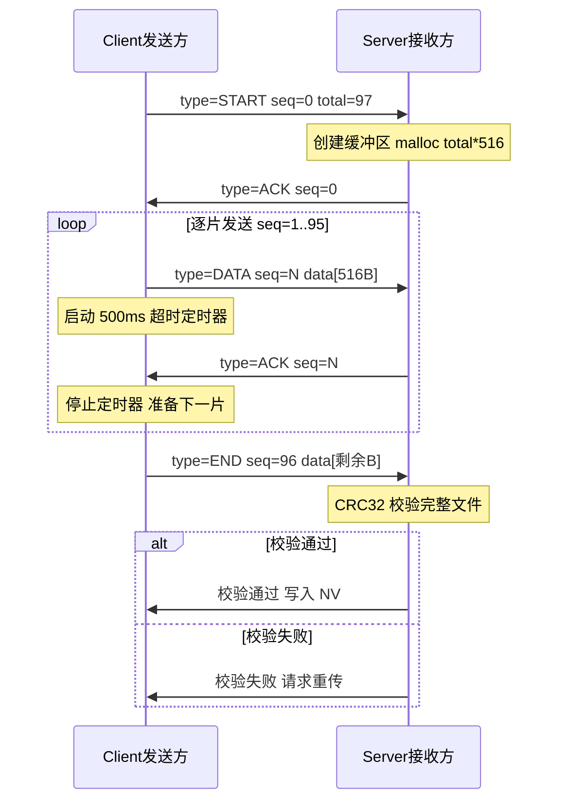
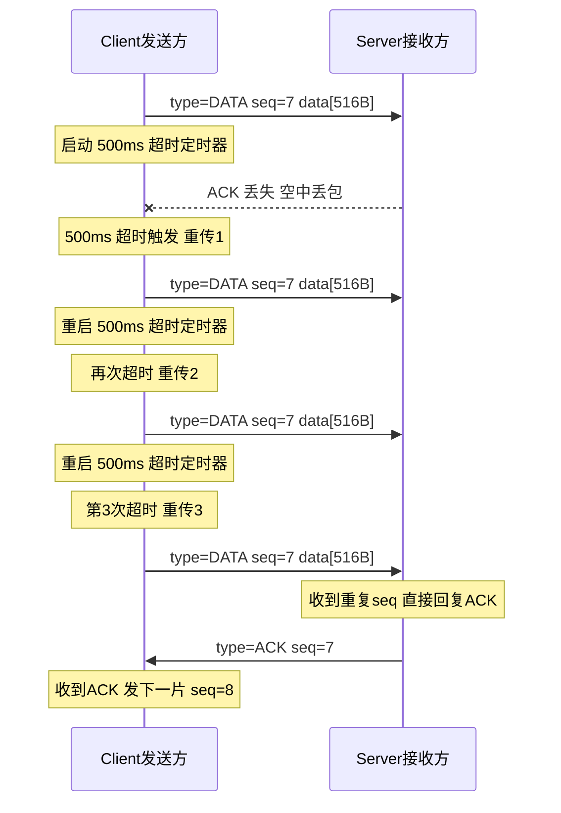
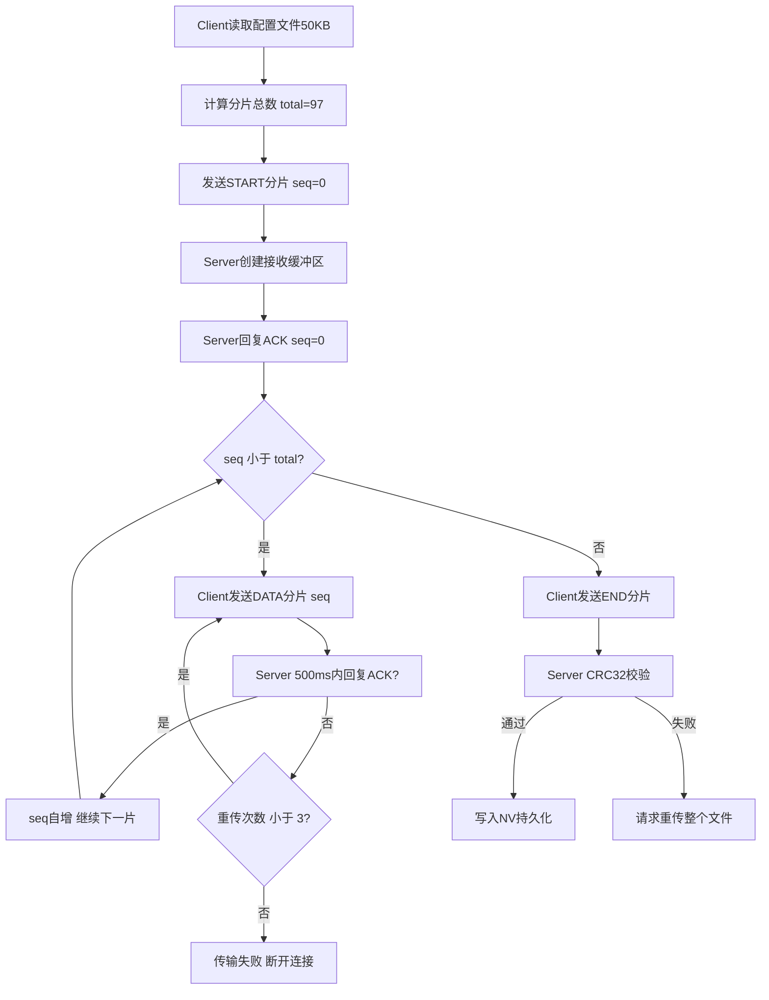

# 分片传输

> SLE (SparkLink Low Energy) SSAP (SLE Service Access Protocol) 通知/写入、MTU (Maximum Transmission Unit) 配置、应用层分片协议

> 前置阅读：[通知推送（Notify）](../basics/hello-notify.md)、[高吞吐传输](./high-throughput.md)

## 学习目标

- 理解数据分片的必要性——单次 `ssaps_notify_indicate()` 能发送的数据受 MTU 限制，大文件/日志/配置表必须分片
- 掌握分片大小的计算方法（MTU − 协议头开销 = 有效载荷）
- 掌握序号 + ACK (Acknowledgment) 的分片可靠传输协议设计与实现
- 理解超时重传和数据重组逻辑，处理丢包与重复包
- 能够在 [CHIP_NAME] 上实现 50KB+ 的可靠大数据块传输

## 基本概念

### 为什么需要分片

SLE 单次 SSAP 发送受 MTU 限制（典型值 520 字节）。当传输配置文件（100KB）、日志导出（100KB+）或固件差分包（500KB+）时，必须将数据切分为多个小于 MTU 的分片，逐个发送并在接收端按序号重组。

### 典型使用场景

| 场景 | 数据量 | 分片数 | 可靠性要求 |
|------|:---:|:---:|:---:|
| 日志导出 | 100KB | ~194 片 | 低（丢几行不影响分析） |
| 配置文件下发 | 50KB | ~97 片 | 高（差一个字节 JSON 解析失败） |
| 固件差分更新 | 500KB | ~970 片 | 极高（差一个 bit 变砖） |
| 密钥/证书下发 | 2KB | ~4 片 | 极高（安全敏感数据） |

### 分片大小计算

分片大小不是拍脑袋定的，它由当前连接的 MTU 减去应用层协议头开销得出：

```text
有效载荷/片 = MTU − 分片协议头
            = 520 − 3 (type=1B + total/seq=2B)
            = 517 字节

分片总数 = 向上取整(文件总大小 / 517)
50KB → 97 片 | 100KB → 194 片 | 500KB → 970 片
```

> 硬编码 `FRAG_PAYLOAD = 516` 的前提是 MTU 固定为 520。正式产品建议通过 `sle_set_data_len()` 查询当前连接的实际 MTU，再动态计算分片大小——MTU 协商结果可能因对端能力而变化。

### 可靠传输 vs 流式传输

分片传输有两种策略，选择取决于业务对完整性的要求：

| 对比维度 | 可靠传输（本案例） | 流式传输 |
|---------|:---:|:---:|
| ACK 机制 | 每片确认 | 不确认 |
| 丢片处理 | 超时重传（最多 3 次） | 忽略，继续发下一片 |
| 完整性校验 | CRC32 端到端 | 不校验 |
| 传输效率 | 较低（等待 ACK 增加延迟） | 较高（连续发送无等待） |
| 典型场景 | 配置文件、固件、密钥 | 日志导出、流媒体、调试输出 |

> 流式传输在发送方算好分片后直接用 `ssapc_write_cmd` 连续发出，不等待任何 ACK。接收方按序号写入即可，丢片位置填 0 或跳过。

### 分片协议头设计

<table style="border-collapse:collapse;min-width:960px;text-align:center;font-size:15px;">
<tr style="background:#e8f0fe;font-weight:bold;font-size:16px;">
<td style="width:160px;border:1px solid #999;padding:10px;">偏移 0<br><small style="font-weight:normal;">1 字节</small></td>
<td style="width:200px;border:1px solid #999;padding:10px;">偏移 1 ~ 2<br><small style="font-weight:normal;">2 字节</small></td>
<td style="border:1px solid #999;padding:10px;">偏移 3 ~ (MTU - 1)<br><small style="font-weight:normal;">0 ~ (MTU - 3) 字节</small></td>
</tr>
<tr>
<td style="border:1px solid #ccc;padding:10px;vertical-align:top;text-align:left;font-size:14px;white-space:nowrap;">
<b>type</b> — 分片类型<br>
0x01 = START（起始分片）<br>
0x02 = DATA（数据分片）<br>
0x03 = END（结束分片）<br>
0x04 = ACK（确认应答）
</td>
<td style="border:1px solid #ccc;padding:10px;vertical-align:top;text-align:left;font-size:14px;">
<b>START 时：total</b> — 总分片数<br>
取值范围 1 ~ 65535<br>
<br>
<b>其他时：seq</b> — 分片序号<br>
从 0 开始递增，取值范围 0 ~ (total - 1)<br>
<br>
<small>偏移 1~2 根据 type 复用：<br>START 存 total，DATA/END/ACK 存 seq</small>
</td>
<td style="border:1px solid #ccc;padding:10px;vertical-align:top;text-align:left;font-size:14px;">
<b>data</b> — 有效载荷<br>
最大长度 = MTU - 3（协议头固定占 3 字节）<br>
ACK 包不携带 data<br>
<em>MTU 为当前连接协商的最大传输单元</em>
</td>
</tr>
</table>

> `total` 为 2 字节，最大可分 65535 片。以每片 513 字节计，单次传输上限约 32MB。超过此上限时需分层分片（先发索引表再发数据分片）。

### 分片传输正常流程



### 超时重传与异常处理



> 重传 3 次仍超时 → 认为连接异常 → 调用 `sle_disconnect_remote_device()` 断开 → 清理发送缓冲区和定时器资源 → 上报传输失败。

## 涉及 API

| API | 谁调用 | 用途 |
|-----|--------|------|
| `sle_set_data_len(conn_id, tx_octets)` | 发送方 | 设置/查询当前连接的最大发送载荷（MTU） |
| `ssaps_set_info(server_id, &info)` | Server | 在注册服务时设置 MTU、UUID (Universally Unique Identifier) 等信息 |
| `ssaps_notify_indicate(conn_id, handle, data, len)` | Server | 向 Client 推送分片数据或 ACK |
| `ssapc_write_req(conn_id, handle, data, len)` | Client | 发送分片数据（带协议栈确认，较慢） |
| `ssapc_write_cmd(conn_id, handle, data, len)` | Client | 快速发送数据片（无协议栈确认，可靠性由自定义 ACK 保证） |
| `osal_timer_start(timer_id, timeout_ms)` | 发送方 | 启动超时重传定时器 |
| `osal_timer_stop(timer_id)` | 发送方 | 收到 ACK 后停止定时器 |

> 本案例选 `ssapc_write_cmd` 而非 `ssapc_write_req`：分片需要高频发送，`write_cmd` 跳过协议栈层确认可减少延迟。可靠性由应用层自定义 ACK + 重传协议保证。

## 案例说明

### 整体目标

Client 将 50KB 配置文件通过分片传输到 Server → Server 逐片接收并写入缓冲区 → 全部接收完成后 CRC32 校验 → 校验通过后写入 NV (Non-Volatile) 持久化存储。传输过程采用可靠传输模式——每片 ACK，丢片超时 500ms 重传，最多重传 3 次。超限则终止传输并上报失败。

### 案例流程架构



### 与高吞吐传输的对比

| 对比维度 | 分片传输（本案例） | 高吞吐传输 |
|---------|:---:|:---:|
| 核心目标 | 可靠性——数据不丢不错 | 速率——最大吞吐量 |
| 发送策略 | 逐片 ACK 后发下一片 | 连续发送 + QoS 流控 |
| 丢包处理 | 超时重传（最多 3 次） | 依赖底层自动重传 |
| 完整性 | CRC32 端到端校验 | 依赖底层 CRC (Cyclic Redundancy Check) |
| 单包延迟 | 较高（等 ACK 往返） | 较低（连续发送） |
| 适用场景 | 配置文件、固件、密钥 | 日志导出、流媒体 |

## 案例操作指导

### 硬件准备

- 2 块 [CHIP_NAME] 开发板：一块作 Client 发送方，一块作 Server 接收方
- 2 条 USB (Universal Serial Bus) 转串口线：供电 + 查看串口日志（波特率 921600）
- 测试数据：事先将 50KB 配置文件烧录到 Client 端 Flash 固定分区

### 操作步骤

1. **编译烧录**：分别编译 `fragmentation_client` 和 `fragmentation_server` 示例，烧录到两块开发板
2. **上电观察**：两块开发板上电，Client 自动扫描并连接 Server
3. **触发传输**：Client 连接成功后按按键触发分片传输（或上电自动触发）
4. **观察进度**：通过串口日志观察传输进度——当前分片序号、ACK 状态、重传次数
5. **验证结果**：传输完成后，Server 打印 CRC32 校验结果和写入 NV 状态

### 预期日志

```text
[SLE Client] 开始分片传输 文件大小=51200B 总分片数=97
[SLE Client] 发送 START 分片 seq=0 total=97
[SLE Client] 收到 ACK seq=0
[SLE Client] 发送 DATA 分片 seq=1
[SLE Client] 收到 ACK seq=1
...
[SLE Client] 发送 DATA 分片 seq=95
[SLE Client] 收到 ACK seq=95
[SLE Client] 发送 END 分片 seq=96
[SLE Server] 接收完成 总字节=51200B
[SLE Server] CRC32 校验通过: 0xA1B2C3D4
[SLE Server] 写入 NV 成功
[SLE Client] 分片传输完成
```

## 关键配置

| 参数 | 推荐值 | 说明 |
|------|:---:|------|
| `FRAG_PAYLOAD` | 516B | MTU 520 − 4B 协议头；若 MTU 协商为其他值需动态调整 |
| `FRAG_TIMEOUT_MS` | 500ms | ACK 等待超时；太长降低效率（等 500ms 才重传），太短导致误判重传 |
| `FRAG_MAX_RETRY` | 3 次 | 超限则终止传输并上报失败 |
| `CRC_TYPE` | CRC32 | 4 字节校验值，端到端数据完整性保证 |
| `FRAG_START_TIMEOUT_MS` | 2000ms | START 包超时可适当放宽，接收方分配缓冲区需要时间 |

> 分片大小不要贪大——516 字节是 MTU 520 下的最优解。设置 518~520 会导致协议头挤占到数据区域之外，SDK底层可能拒绝发送或截断。

## 代码详解

### 1. 分片协议头定义与打包/解析

```c
/* ── 分片协议常量 ── */
#define FRAG_TYPE_START   0x01
#define FRAG_TYPE_DATA    0x02
#define FRAG_TYPE_END     0x03
#define FRAG_TYPE_ACK     0x04

#define FRAG_HEADER_SIZE  4        /* type(1) + seq(2) + total(1) */
#define FRAG_MTU          520
#define FRAG_PAYLOAD      (FRAG_MTU - FRAG_HEADER_SIZE)  /* 516B */

/* ── 分片包结构 ── */
typedef struct {
    uint8_t  type;          /* 0x01=START 0x02=DATA 0x03=END 0x04=ACK */
    uint16_t seq;           /* 分片序号 从0递增 */
    uint8_t  total;         /* 总分片数 仅type=0x01时有效 */
    uint8_t  data[FRAG_PAYLOAD];
} frag_pkt_t;

/* ── 打包发送分片 ── */
static errcode_t frag_send_packet(uint16_t conn_id, uint16_t handle,
    uint8_t type, uint16_t seq, uint8_t total,
    const uint8_t *data, uint16_t data_len)
{
    frag_pkt_t pkt;
    pkt.type  = type;
    pkt.seq   = seq;
    pkt.total = total;

    uint16_t pkt_len = FRAG_HEADER_SIZE;
    if (data != NULL && data_len > 0) {
        if (memcpy_s(pkt.data, FRAG_PAYLOAD, data, data_len) != EOK) {
            return ERRCODE_FAIL;
        }
        pkt_len += data_len;
    }
    return ssapc_write_cmd(conn_id, handle, (uint8_t *)&pkt, pkt_len);
}
```

### 2. 发送方分片循环

```c
/* ── 发送方全局状态 ── */
static uint8_t      *g_send_file_buf = NULL;  /* 待发送文件缓冲区 */
static uint32_t      g_send_file_len = 0;      /* 文件总长度 */
static uint16_t      g_send_seq      = 0;      /* 当前分片序号 */
static uint8_t       g_send_total    = 0;      /* 总分片数 */
static uint8_t       g_retry_count   = 0;      /* 当前分片重传次数 */
static struct osal_timer *g_frag_timer = NULL; /* 超时重传定时器 */

/* ── 发送下一片 ── */
static void frag_send_next(uint16_t conn_id, uint16_t handle)
{
    uint32_t offset = g_send_seq * FRAG_PAYLOAD;
    uint16_t chunk  = (offset + FRAG_PAYLOAD <= g_send_file_len)
                    ? FRAG_PAYLOAD
                    : (uint16_t)(g_send_file_len - offset);

    if (g_send_seq + 1 >= g_send_total) {
        /* 最后一片：type=END */
        frag_send_packet(conn_id, handle, FRAG_TYPE_END,
                         g_send_seq, 0, g_send_file_buf + offset, chunk);
    } else {
        frag_send_packet(conn_id, handle, FRAG_TYPE_DATA,
                         g_send_seq, 0, g_send_file_buf + offset, chunk);
    }

    g_retry_count = 0;
    osal_timer_start(g_frag_timer, 500);  /* 启动500ms超时 */
}

/* ── 启动分片传输 ── */
errcode_t frag_start_transfer(uint16_t conn_id, uint16_t handle,
    const uint8_t *file_data, uint32_t file_len)
{
    /* 分配发送缓冲区并拷贝文件数据 */
    g_send_file_buf = malloc(file_len);
    if (g_send_file_buf == NULL) { return ERRCODE_MALLOC; }
    memcpy_s(g_send_file_buf, file_len, file_data, file_len);
    g_send_file_len = file_len;

    /* 计算分片数 */
    g_send_total = (uint8_t)((file_len + FRAG_PAYLOAD - 1) / FRAG_PAYLOAD);
    g_send_seq   = 0;

    osal_printk("开始分片传输 文件大小=%uB 总分片数=%u\r\n",
                file_len, g_send_total);

    /* 发送 START 分片 */
    frag_send_packet(conn_id, handle, FRAG_TYPE_START, 0, g_send_total, NULL, 0);
    osal_timer_start(g_frag_timer, 2000);  /* START包超时放宽到2000ms */
    return ERRCODE_SUCC;
}
```

### 3. 接收方顺序接收、重组与 CRC 校验

```c
/* ── 接收方全局状态 ── */
static uint8_t  *g_rx_file_buf = NULL;    /* 接收缓冲区 */
static uint32_t  g_rx_file_len = 0;        /* 已接收字节数 */
static uint8_t   g_rx_total    = 0;        /* 总分片数 */
static uint32_t  g_rx_crc_expected = 0;    /* 预期 CRC32（随START带下来或预先约定） */

/* ── 接收分片回调 ── */
static void on_frag_received(uint16_t conn_id, uint16_t handle,
    const uint8_t *data, uint16_t len)
{
    if (len < FRAG_HEADER_SIZE) { return; }

    const frag_pkt_t *pkt = (const frag_pkt_t *)data;
    osal_printk("收到分片 type=0x%02X seq=%u\r\n", pkt->type, pkt->seq);

    switch (pkt->type) {
    case FRAG_TYPE_START:
        /* 创建接收缓冲区 */
        g_rx_total    = pkt->total;
        g_rx_file_len = (uint32_t)g_rx_total * FRAG_PAYLOAD;
        g_rx_file_buf = malloc(g_rx_file_len);
        if (g_rx_file_buf == NULL) {
            osal_printk("分配接收缓冲区失败\r\n");
            return;
        }
        memset_s(g_rx_file_buf, g_rx_file_len, 0, g_rx_file_len);
        /* 回复 ACK */
        frag_send_packet(conn_id, handle, FRAG_TYPE_ACK, pkt->seq, 0, NULL, 0);
        break;

    case FRAG_TYPE_DATA:
        /* 按 seq 计算偏移写入缓冲区 */
        {
            uint32_t offset = (uint32_t)pkt->seq * FRAG_PAYLOAD;
            uint16_t data_len = len - FRAG_HEADER_SIZE;
            memcpy_s(g_rx_file_buf + offset,
                     g_rx_file_len - offset, pkt->data, data_len);
            frag_send_packet(conn_id, handle, FRAG_TYPE_ACK, pkt->seq, 0, NULL, 0);
        }
        break;

    case FRAG_TYPE_END:
        /* 写入最后一片数据 + CRC32 校验 */
        {
            uint32_t offset = (uint32_t)pkt->seq * FRAG_PAYLOAD;
            uint16_t data_len = len - FRAG_HEADER_SIZE;
            memcpy_s(g_rx_file_buf + offset,
                     g_rx_file_len - offset, pkt->data, data_len);

            uint32_t actual_len = offset + data_len;
            uint32_t crc = crc32_calc(g_rx_file_buf, actual_len);
            osal_printk("接收完成 总字节=%u CRC32=0x%08X\r\n", actual_len, crc);

            if (crc == g_rx_crc_expected) {
                /* 写入 NV 持久化 */
                uapi_nv_write(NV_ID_CONFIG_FILE, g_rx_file_buf, actual_len);
                osal_printk("CRC32 校验通过 写入 NV 成功\r\n");
                /* 回复成功 */
                frag_send_packet(conn_id, handle, FRAG_TYPE_ACK, pkt->seq, 0, NULL, 0);
            } else {
                osal_printk("CRC32 校验失败 请求重传\r\n");
                /* 通知对端重传整个文件 */
            }
            free(g_rx_file_buf);
            g_rx_file_buf = NULL;
        }
        break;

    default:
        break;
    }
}
```

### 4. 超时重传与错误处理

```c
/* ── 超时重传定时器回调 ── */
static void frag_timeout_cb(uintptr_t arg)
{
    uint16_t conn_id = (uint16_t)(arg & 0xFFFF);
    uint16_t handle  = (uint16_t)(arg >> 16);

    g_retry_count++;
    if (g_retry_count > 3) {
        /* 超过最大重传次数 终止传输 */
        osal_printk("分片 seq=%u 重传%d次失败 终止传输\r\n",
                    g_send_seq, g_retry_count - 1);
        free(g_send_file_buf);
        g_send_file_buf = NULL;
        sle_disconnect_remote_device(&g_remote_addr);
        return;
    }

    osal_printk("分片 seq=%u 超时 重传%d 次\r\n", g_send_seq, g_retry_count);

    /* 重发当前分片——seq 不变 */
    uint32_t offset = (uint32_t)g_send_seq * FRAG_PAYLOAD;
    uint16_t chunk  = (offset + FRAG_PAYLOAD <= g_send_file_len)
                    ? FRAG_PAYLOAD
                    : (uint16_t)(g_send_file_len - offset);

    uint8_t type = (g_send_seq + 1 >= g_send_total) ? FRAG_TYPE_END : FRAG_TYPE_DATA;
    frag_send_packet(conn_id, handle, type, g_send_seq, 0,
                     g_send_file_buf + offset, chunk);
    osal_timer_start(g_frag_timer, 500);
}

/* ── 收到 ACK 后的处理 ── */
static void frag_on_ack_received(uint16_t conn_id, uint16_t handle,
    uint16_t ack_seq)
{
    osal_timer_stop(g_frag_timer);  /* 停止超时定时器 */

    if (ack_seq != g_send_seq) {
        /* ACK 序号不匹配 忽略（可能是迟到的旧ACK） */
        osal_printk("忽略过期ACK seq=%u 当前seq=%u\r\n", ack_seq, g_send_seq);
        return;
    }

    /* 判断是否发完所有分片 */
    if (g_send_seq + 1 >= g_send_total) {
        osal_printk("分片传输完成 总 %u 片\r\n", g_send_total);
        free(g_send_file_buf);
        g_send_file_buf = NULL;
        return;
    }

    /* 发下一片 */
    g_send_seq++;
    frag_send_next(conn_id, handle);
}
```

> 接收方收到重复 seq 的分片时，不需要重复写入缓冲区——直接回复 ACK 即可（说明对端的 ACK 丢了，但数据已经正确接收）。

---

