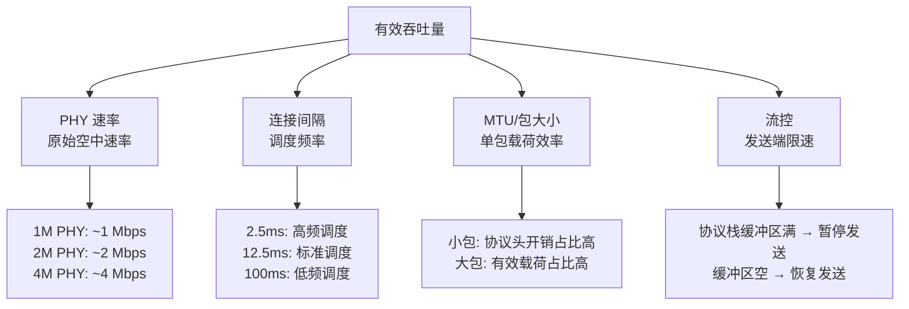
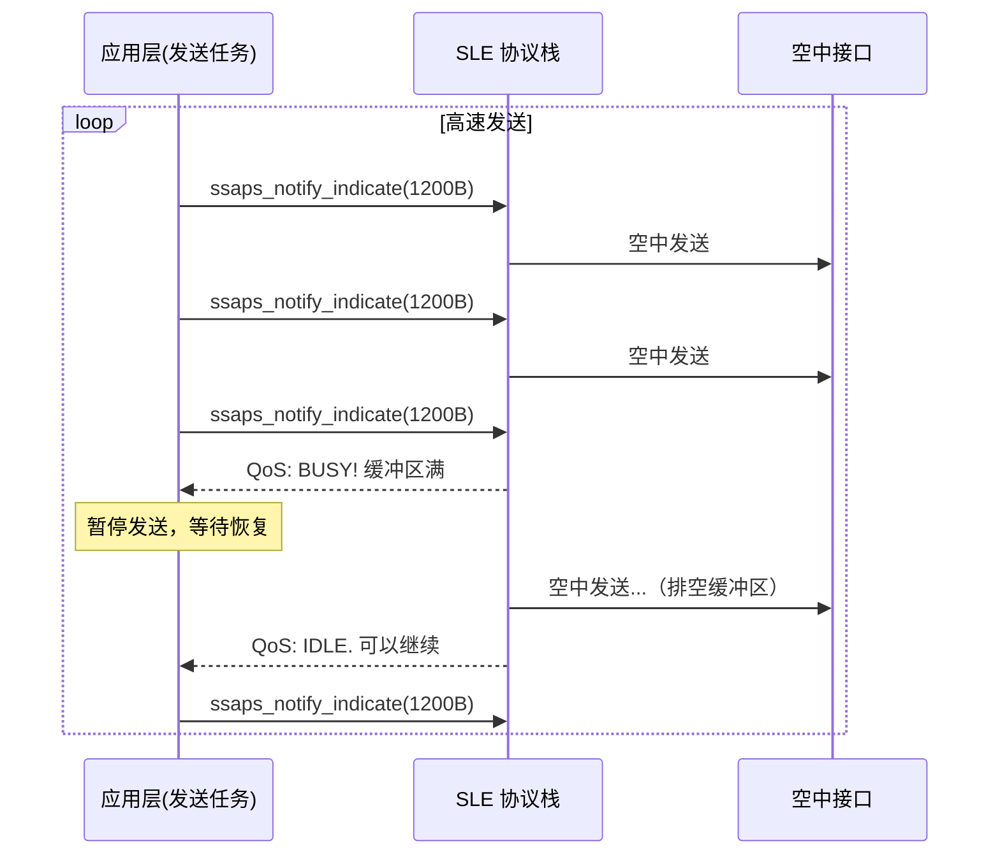
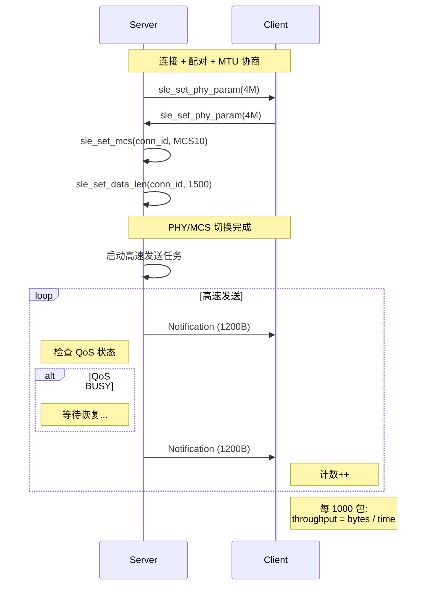

# 高吞吐传输

> 使用技术：SLE (SparkLink Low Energy) PHY/MCS 配置、连接参数与发送流控。测试方法见 [吞吐量测试](../test-debug/throughput-test.md)，动态档位策略见 [无线链路自适应（PHY/MCS）](../link-mgmt/phy-mcs-switch.md)。

> 前置阅读：[通知推送（Notify）](../basics/hello-notify.md)、[连接参数动态更新](../link-mgmt/conn-param-tuning.md)

## 学习目标

- 理解影响 SLE 吞吐量的关键因素：PHY (Physical Layer) 速率、MCS (Modulation and Coding Scheme) 编码、连接间隔、MTU (Maximum Transmission Unit) 大小
- 掌握 4M PHY + MCS10 高吞吐配置的启用方法
- 理解 QoS 流控机制及其在高速发送中的作用
- 能够配置并运行两块 [CHIP_NAME] 之间的持续数据传输

## 规格与功能

本案例演示如何将 SLE 调到最高吞吐模式，实现大块数据的持续高速传输。

| 规格项 | 配置值 | 说明 |
|--------|--------|------|
| PHY 模式 | 4M | SLE 支持的最高 PHY 速率 |
| MCS 编码 | MCS10 (8PSK 3/4) | 高效调制编码方案 |
| 连接间隔 | 2.5ms (0x14) | 最短连接间隔，最大化调度密度 |
| MTU 大小 | 1500 字节 | 单次最大传输单元 |
| 数据包大小 | 1200 字节/包 | 接近 MTU 上限，减少分包 |
| 流控方式 | QoS 忙检测 + 重试 | 避免协议栈缓冲区溢出 |
| 统计方式 | 每 1000 包统计平均速率 | 滑动窗口，消除瞬时抖动 |

程序运行流程：

1. Server 和 Client 建立连接、配对、MTU 协商
2. 双方切换到 4M PHY + MCS10（通过 `sle_set_phy_param` + `sle_set_mcs`）
3. Server 进入高速发送循环：打包 1200 字节 → 发 Notification → 检查流控 → 继续
4. Client 接收并统计：计数包数 → 每 1000 包计算速率 → 打印吞吐量

> 高吞吐模式会显著增加功耗、缩短通信距离。仅在有大数据传输需求时使用，常规数据传输使用默认 1M PHY 即可。

## 基本概念

### 典型使用场景

高吞吐传输适用于需要短时间内传输大量数据的场景，而非持续的传感器数据上报。例如：

- **OTA (Over-The-Air) 固件升级**：几百 KB ~ 几 MB 的固件包需要快速分发
- **日志导出**：设备本地存储的运行日志批量导出到手机
- **文件传输**：图片、音频文件在设备间交换
- **数据同步**：离线采集的传感器数据批量同步到云端

### 吞吐量的四个决定因素



| 因素 | 物理含义 | 对吞吐量的影响 |
|------|---------|--------------|
| **PHY 速率** | 空中原始比特率（1M/2M/4M） | 上限决定者——PHY 1M 永远不可能超过 ~1Mbps |
| **MCS 编码** | 调制编码方案（BPSK→8PSK） | MCS 越高每符号携带比特越多，但抗干扰越差 |
| **连接间隔** | 两个连接事件之间的时间 | 间隔越短调度越密集，吞吐越高但功耗越大 |
| **MTU / 包大小** | 单次传输的有效载荷上限 | 包越大协议头占比越低，有效吞吐越高 |

### MCS 编码速查

| MCS | 调制方式 | 码率 | 最大 PHY 速率 | 适用场景 |
|:---:|---------|:---:|-------------|---------|
| MCS0 | BPSK | 1/4 | 0.25 Mbps | 极远距、强抗干扰 |
| MCS4 | BPSK | 1 | 1.0 Mbps | 远距标准 |
| MCS8 | QPSK (Quadrature Phase Shift Keying) | 1 | 2.0 Mbps | 中距高速 |
| MCS9 | 8PSK | 5/8 | 2.5 Mbps | 中距高速 |
| **MCS10** | **8PSK** | **3/4** | **3.0 Mbps** | **近距超高速** |
| MCS11 | 8PSK | 7/8 | 3.5 Mbps | 极近距 |
| MCS12 | 8PSK | 1 | 4.0 Mbps | 极近距（误码率高） |

> MCS10 是实际应用中最常用的高吞吐选项——速率高（3.0 Mbps）且抗干扰尚可。MCS11/MCS12 理论速率更高，但对信号质量要求严苛，实际有效吞吐可能反而不如 MCS10。

### 流控：为什么不能一直发

协议栈的发送缓冲区是有限的。如果应用层发得太快，超过协议栈处理速度，数据会被丢弃或阻塞。SLE 提供 QoS 流控机制来告知应用层当前的发送能力：



## 涉及 API

本案例在 hello-notify 基础上新增 PHY/MCS 配置和流控相关 API：

| API | 谁调用 | 用途 |
|-----|--------|------|
| `sle_set_phy_param()` | Server / Client | 设置 PHY 参数（射频帧类型、PHY 速率、导频密度） |
| `sle_set_mcs()` | Server / Client | 设置 MCS 调制编码等级 |
| `sle_set_data_len()` | Server | 设置本端最大发送载荷字节数 |
| `sle_connection_register_callbacks()` | Server | 注册连接回调（包含 PHY 设置完成回调、QoS 回调） |
| `ssaps_notify_indicate()` | Server | 发送高速数据（hello-notify 中已介绍） |
| `osal_get_cur_time_ms()` | Client | 计时用于速率计算 |

## 案例说明

### 案例简介

两台 [CHIP_NAME]，Server 持续向 Client 发送大包数据（1200 字节/包），使用 4M PHY + MCS10 + 2.5ms 连接间隔的最大吞吐配置。Client 每收到 1000 包计算一次有效吞吐率。

### 案例流程说明



### 高吞吐 vs 常规模式配置对比

| 参数 | 常规模式 | 高吞吐模式 |
|------|---------|----------|
| PHY | 1M | 4M |
| MCS | MCS4 (BPSK) | MCS10 (8PSK 3/4) |
| 连接间隔 | 12.5ms | 2.5ms |
| MTU | 520 字节 | 1500 字节 |
| 数据包大小 | 500 字节 | 1200 字节 |
| 预期吞吐量 | ~40 KB/s | ~200-300 KB/s |
| 功耗 | ~5mA | ~15mA |
| 通信距离 | 正常 | 缩短约 30~50% |

## 案例操作指导

### 第一步：编译

```bash
fbb build [CHIP_NAME]-liteos-app
```

> 更多编译选项请参考 [构建操作](../../../../overall-architecture/build-output/index.md#构建操作)。

### 第二步：烧录

```bash
fbb flash [CHIP_NAME]-liteos-app
```

> 更多烧录选项请参考 [构建操作](../../../../overall-architecture/build-output/index.md#构建操作)。

### 第三步：观察吞吐量

Server 预期输出：

```text
[speed server] connected.
[speed server] phy set to 4M, mcs set to 10.
[speed server] start sending...
[speed server] sent 5000 packets...
```

Client 预期输出：

```text
[speed client] connected.
[speed client] phy set to 4M.
[speed client] receiving...
[speed client] [0-999]   throughput: 285.3 KB/s, rssi: -45 dBm
[speed client] [1000-1999] throughput: 290.1 KB/s, rssi: -44 dBm
[speed client] [2000-2999] throughput: 287.8 KB/s, rssi: -45 dBm
```

## 关键配置

### 高吞吐 PHY 参数

```c
sle_set_phy_t phy_param = {0};
phy_param.tx_format        = SLE_RADIO_FRAME_4_M0;
phy_param.rx_format        = SLE_RADIO_FRAME_4_M0;
phy_param.tx_phy           = SLE_PHY_4M;
phy_param.rx_phy           = SLE_PHY_4M;
phy_param.tx_pilot_density = SLE_PHY_PILOT_DENSITY_16_TO_1;  // 低导频密度
phy_param.rx_pilot_density = SLE_PHY_PILOT_DENSITY_16_TO_1;

sle_set_phy_param(conn_id, &phy_param);
```

> `tx_pilot_density` 设 16:1 时导频占比最低，数据占比最高，适合高信噪比环境。如果信号不好（RSSI (Received Signal Strength Indicator) < -70 dBm），建议改为 8:1 或 4:1 以增强接收可靠性。

### MCS 选择策略

```c
int8_t avg_rssi = get_average_rssi();

if (avg_rssi > -50) {
    sle_set_mcs(conn_id, SLE_MCS_10);  // 信号强: MCS10 跑满
} else if (avg_rssi > -65) {
    sle_set_mcs(conn_id, SLE_MCS_8);   // 信号中等: QPSK 稳一点
} else if (avg_rssi > -75) {
    sle_set_mcs(conn_id, SLE_MCS_4);   // 信号弱: 退到 BPSK
} else {
    // 信号极弱: 降 PHY 到 1M
    sle_set_phy_to_1m();
    sle_set_mcs(conn_id, SLE_MCS_4);
}
```

> MCS 越高对信号质量越敏感。如果在 MCS10 下出现大量丢包，先检查 RSSI——信号弱时退到 MCS8 反而可能提高有效吞吐。

### 连接参数必须匹配高吞吐

```c
// 广播参数中的连接间隔需要匹配高吞吐
sle_announce_param_t param = {0};
// 高吞吐用 2.5ms
param.conn_interval_min = 0x14;  // 20 × 125us = 2.5ms
param.conn_interval_max = 0x14;
// 常规模式用 12.5ms
// param.conn_interval_min = 0x64;
```

| 连接间隔 | 每秒连接事件数 | 实际有效吞吐 (4M/MCS10) |
|:---:|:---:|:---:|
| 2.5ms | 400 | ~280 KB/s |
| 7.5ms | 133 | ~140 KB/s |
| 12.5ms | 80 | ~100 KB/s |

## 代码详解

### PHY/MCS 异步设置流程

PHY 参数设置是异步的——调用 `sle_set_phy_param()` 后不能立即调用 `sle_set_mcs()`，必须在 `set_phy_cb` 回调中串行执行：

```c
// 第一步：设置 PHY
static void start_high_throughput(void)
{
    sle_set_phy_t phy_param = build_4m_phy_param();
    sle_set_phy_param(g_conn_id, &phy_param);
    // 不要在这里接着调 sle_set_mcs!
}

// 第二步：PHY 设置完成的回调中设置 MCS
static void set_phy_cb(uint16_t conn_id, errcode_t status,
                       const sle_set_phy_t *param)
{
    if (status != ERRCODE_SUCC) {
        printf("[speed] set phy failed: %d\n", status);
        return;
    }
    printf("[speed] phy set to 4M\n");
    // 此时才能设置 MCS
    sle_set_mcs(conn_id, SLE_MCS_10);
    sle_set_data_len(conn_id, 1500);
}

// 第三步：MCS 设置完成后开始发送
static void set_mcs_cb(uint16_t conn_id, errcode_t status, uint8_t mcs)
{
    if (status == ERRCODE_SUCC) {
        printf("[speed] mcs set to %d, start sending\n", mcs);
        start_send_task();
    }
}
```

### 高速发送循环（含流控）

```c
static void high_speed_send_task(void *arg)
{
    uint8_t tx_buf[1200];
    uint32_t pkt_count = 0;

    while (g_sending) {
        // 1. 检查连接状态
        if (g_conn_id == 0) {
            osal_sleep_ms(10);
            continue;
        }

        // 2. 打包数据（填入递增序号用于丢包检测）
        fill_packet_data(tx_buf, sizeof(tx_buf), pkt_count);

        // 3. 发送
        errcode_t ret = ssaps_notify_indicate(g_conn_id, g_property_handle,
                                               SSAP_PROPERTY_TYPE_VALUE,
                                               tx_buf, sizeof(tx_buf),
                                               SSAP_NOTIFY_TYPE_NOTIFICATION);
        if (ret == ERRCODE_SUCC) {
            pkt_count++;
        } else if (ret == ERRCODE_SLE_BUSY) {
            osal_sleep_ms(1);  // 协议栈忙，等一会儿再试
        } else {
            printf("[speed] send failed: %d\n", ret);
        }

        osal_task_yield();  // 让出 CPU
    }
}
```

### 测试与动态调优

本篇以实现数据通道为边界，不再重复测试统计和自适应切换代码：

- 有效吞吐、丢包率、测试矩阵和报告格式见 [吞吐量测试](../test-debug/throughput-test.md)。
- RSSI 阈值、迟滞和动态档位状态机见 [无线链路自适应（PHY/MCS）](../link-mgmt/phy-mcs-switch.md)。

> 2.5ms 连接间隔 + 4M PHY 是最快组合，但功耗为常规模式的 3 倍。长时间高吞吐传输时注意芯片散热。

---

