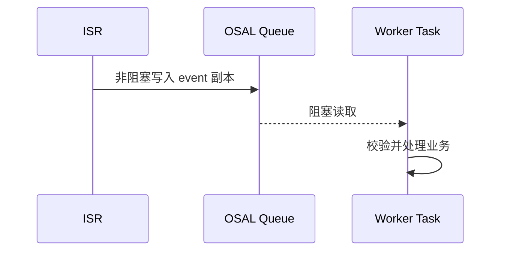

# OSAL 消息队列：ISR 到任务

> 使用 OSAL (Operating System Abstraction Layer) 消息队列把中断事件安全地交给任务。本页不重复中断注册和 ISR (Interrupt Service Routine) 约束，前置见 [OSAL 中断管理](../interrupt/osal-interrupt.md)。

## 适用场景

消息队列适合事件不仅需要“唤醒”，还需要携带类型、时间戳、引脚号或数据值的场景。若只需要通知一次，可优先使用信号量或事件标志。

## 数据流



## 消息设计

消息结构应固定大小且只包含任务真正需要的字段，例如：

```c
typedef struct {
    uint32_t type;
    uint32_t source;
    uint32_t timestamp;
    uint32_t value;
} app_event_t;
```

ISR 使用非阻塞写入；工作任务可以阻塞等待。不要从 ISR 投递指向栈变量的指针。

## 队列满策略

| 策略 | 适用情况 |
| --- | --- |
| 丢弃新消息并计数 | 状态刷新类事件，后续事件可覆盖 |
| 覆盖同类旧消息 | 只关心最新状态 |
| 设置溢出标志 | 需要任务执行恢复或重新同步 |
| 增大队列 | 已确认峰值合理且 RAM (Random Access Memory) 预算允许 |

ISR 不能等待队列出现空位。队列持续满通常表示任务优先级、处理耗时或消息模型存在问题，不应只靠无限增大队列掩盖。

## 源码参考

```text
vendor/HiHope_NearLink_DK_[CHIP_NAME]E_V03/demo/message/
vendor/Hqyj_[CHIP_NAME]/Farsight/kernel_08_message_queque/
```

## 验证清单

- 正常事件按顺序到达任务。
- 高频事件下能够观察到并处理队列满。
- 任务重启或停止时不会读取失效对象。
- 消息长度、队列元素大小和读写接口参数一致。
