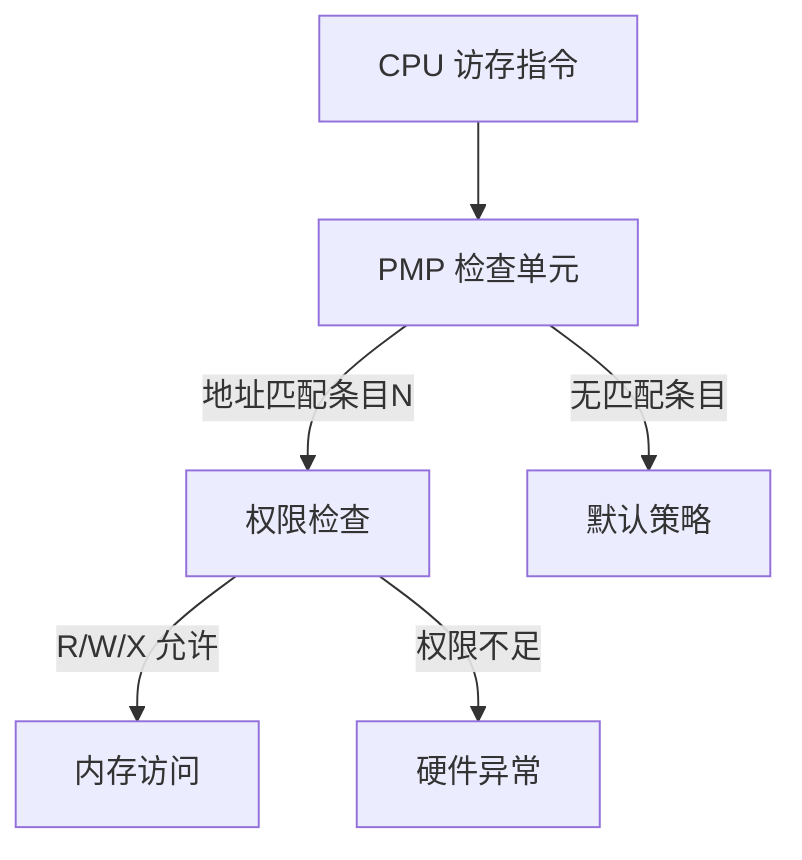
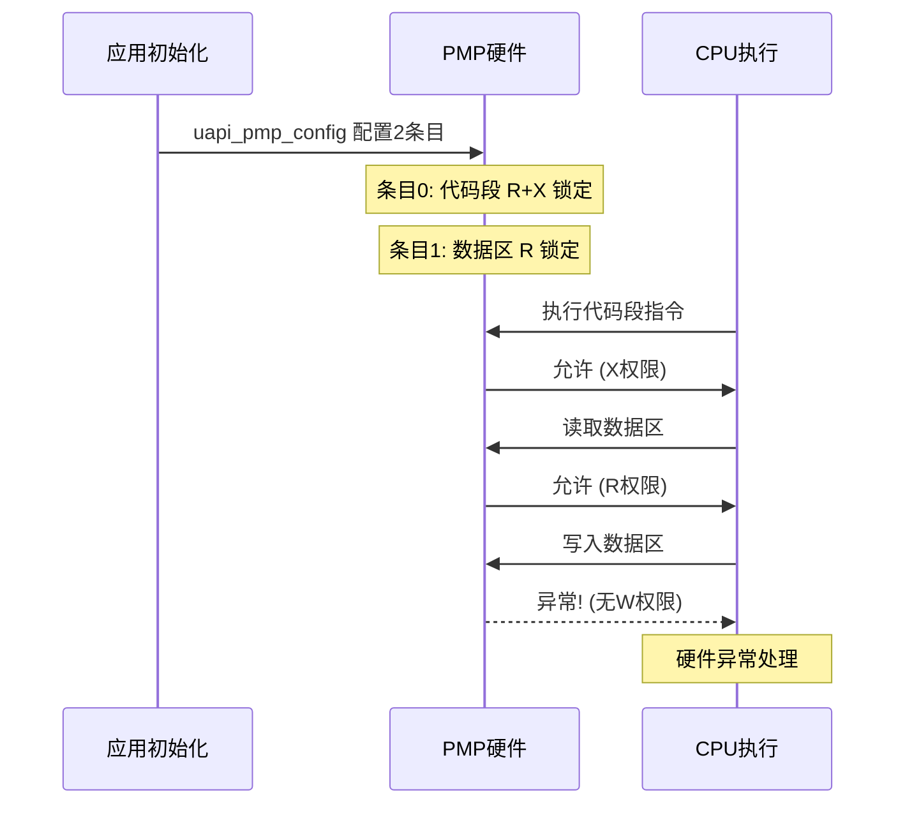

# PMP

> PMP (Physical Memory Protection) 驱动 | 无 sample

## 学习目标

- 理解 PMP——RISC-V 架构的硬件级内存访问控制机制
- 掌握 `pmp_conf_t` 结构体各字段含义——地址匹配、权限、属性、锁定
- 掌握 `uapi_pmp_config` 批量配置多条 PMP 条目
- 能够在 [CHIP_NAME] 上保护关键内存区域（固件代码、安全密钥）不被意外修改

## 基本概念

### PMP 做什么

PMP是 RISC-V 指令集定义的硬件内存保护机制。通过配置一组 PMP 条目，为物理内存区域设置**读/写/执行权限**。当 CPU 对受保护区域进行违规访问时，硬件直接触发异常——比软件检查更安全、更高效。



### 3 种地址匹配模式

| 模式 | 枚举 | 匹配方式 | 粒度 |
|------|------|------|:---:|
| TOR | `PMPCFG_ADDR_MATCH_TOR` | 地址范围 [上一条目地址, 本条地址) | 任意 |
| NA4 | `PMPCFG_ADDR_MATCH_NA4` | 自然对齐 4 字节 | 4B |
| NAPOT (Naturally Aligned Power-Of-Two) | `PMPCFG_ADDR_MATCH_NAPOT` | 自然对齐 2 的幂（最小 8B） | 2^n |

- **TOR**：最常用——配置连续的多个条目形成互不重叠的保护区域
- **NAPOT**：适合保护 2 的幂大小区域（如 4KB 固件页）
- **NA4**：仅 4 字节粒度——保护单个变量

### 权限和属性

**读写执行权限**（`rwx_permission_t`）：

| 权限 | 枚举值 | 读 | 写 | 执行 |
|------|:---:|:---:|:---:|:---:|
| 无权限 | `PMPCFG_NO_ACCESS` | N | N | N |
| 只读 | `PMPCFG_READ_ONLY_NEXECUTE` | Y | N | N |
| 读写 | `PMPCFG_RW_NEXECUTE` | Y | Y | N |
| 只读+执行 | `PMPCFG_READ_ONLY_EXECUTE` | Y | N | Y |
| 完全 | `PMPCFG_RW_EXECUTE` | Y | Y | Y |

**内存属性**（`pmp_attr_t`）：控制 Cache 和 Buffer 行为——从 `DEVICE_NO_BUFFERABLE` 到 `WRITEBACK_RWALLOCATE` 共 10 级。

### L 位锁定

`lock = true` 后该条目**不可被软件修改**——直到芯片复位。这是 PMP 安全关键特性：一旦锁定，即使是内核代码也无法更改内存保护规则。用于：

- 固件安全启动——锁住 BootROM 区域
- 功能安全（FuSa）——锁住关键配置区
- 防篡改——锁住密钥存储区

## 涉及 API

| API | 用途 | 头文件 |
|-----|------|--------|
| `uapi_pmp_config(const pmp_conf_t *config, uint32_t length)` | 批量配置 PMP 条目 | `drv_pmp.h` |

> `pmp_conf_t` 结构体字段：`idx`（条目编号）、`addr`（基/尾地址）、`size`（NAPOT 模式使用）、`conf`（`pmpx_config_t` 含 `rwx_permission`、`addr_match`、`lock`、`pmp_attr`）。

## 案例说明

### 案例简介

配置两条 PMP 条目：
- 条目 0：保护代码段为只读+执行（TOR 模式）
- 条目 1：保护关键数据区为只读（TOR 模式）

配置后任何对代码段的写操作或对关键数据区的写操作均触发硬件异常。

### 功能规格

| 规格项 | 说明 |
|--------|------|
| 条目 0 | 代码段，TOR 匹配，只读+执行，锁定 |
| 条目 1 | 关键数据区，TOR 匹配，只读 |
| 匹配模式 | TOR（地址范围） |
| 内存属性 | `PMP_ATTR_WRITEBACK_RWALLOCATE`（正常内存） |

程序运行流程：定义 `pmp_conf_t` 数组 → 调用 `uapi_pmp_config` → 尝试写保护区 → 触发硬件异常 → 异常处理打印信息。

### 案例流程



## 案例操作指导

### 第一步：编译

```bash
fbb build [CHIP_NAME]-liteos-app
```

> 更多编译选项请参考 [构建操作](../../../overall-architecture/build-output/index.md#构建操作)。

### 第二步：烧录

```bash
fbb flash [CHIP_NAME]-liteos-app
```

> 更多烧录选项请参考 [构建操作](../../../overall-architecture/build-output/index.md#构建操作)。

### 第三步：预期输出

```text
PMP: config 2 entries
PMP: entry[0] code section R+X, locked
PMP: entry[1] data section R, locked
PMP: protection active
... (正常执行) ...
Exception: Store access fault at 0x2000_1000
```

## 关键配置

| 参数 | 值 | 说明 |
|------|-----|------|
| 条目数量 | 硬件限制（通常 8~16） | 超出则 `uapi_pmp_config` 返回失败 |
| 匹配模式 | TOR / NA4 / NAPOT | TOR 最灵活——连续条目形成无间隙保护 |
| Lock 位 | true 锁定不可逆 | 仅在确认配置正确后锁定 |
| 地址对齐 | 模式决定 | NA4 需 4B 对齐，NAPOT 需 2^n 对齐 |
| Cache 属性 | 根据内存类型选择 | SRAM (Static Random Access Memory) 用 WRITEBACK，MMIO 用 DEVICE |

### PMP vs Mem Monitor 选择

| 需求 | 推荐 | 原因 |
|------|:---:|------|
| 调试阶段找出非法访问来源 | Mem Monitor | 有回调打印信息 |
| 生产固件安全保护 | PMP | 硬件级、不可绕过 |
| 防止代码被篡改 | PMP + Lock | Lock 后不可篡改 |
| 记录每次违规访问 | Mem Monitor | 回调可记录日志 |

### 内存属性选择参考

| 内存类型 | Cache 属性 | Buffer 属性 | 枚举值示例 |
|------|:---:|:---:|------|
| SRAM 数据 | WriteBack | 是 | `PMP_ATTR_WRITEBACK_RWALLOCATE` |
| Flash 代码 | WriteBack | 是 | `PMP_ATTR_WRITEBACK_RALLOCATE` |
| MMIO 寄存器 | 无 | 否 | `PMP_ATTR_DEVICE_NO_BUFFERABLE` |

## 代码详解

> 概念性代码，基于 SDK头文件 `drv_pmp.h` 中的 API 签名。

```c
#include "drv_pmp.h"
#include "errcode.h"
#include "osal_printk.h"
#include "app_init.h"

/* 假设的内存布局（实际需从 linker script 获取） */
#define CODE_START  0x00000000
#define CODE_END    0x00040000
#define DATA_START  0x20000000
#define DATA_END    0x20001000

static void pmp_entry(void)
{
    errcode_t ret;

    /* 定义两条 PMP 保护条目 */
    pmp_conf_t pmp_cfg[] = {
        /* 条目 0：保护代码段——只读+执行，锁定 */
        {
            .idx  = 0,
            .addr = CODE_END,       /* TOR 模式：尾地址 */
            .size = 0,              /* TOR 模式不使用 size */
            .conf = {
                .rwx_permission = PMPCFG_READ_ONLY_EXECUTE,
                .addr_match     = PMPCFG_ADDR_MATCH_TOR,
                .lock           = true,  /* 锁定——不可软件修改 */
                .pmp_attr       = PMP_ATTR_WRITEBACK_RALLOCATE
            }
        },
        /* 条目 1：保护关键数据区——只读 */
        {
            .idx  = 1,
            .addr = DATA_END,       /* TOR 模式：尾地址 */
            .size = 0,
            .conf = {
                .rwx_permission = PMPCFG_READ_ONLY_NEXECUTE,
                .addr_match     = PMPCFG_ADDR_MATCH_TOR,
                .lock           = false, /* 不锁定——后续可修改 */
                .pmp_attr       = PMP_ATTR_WRITEBACK_RWALLOCATE
            }
        }
    };

    /* 批量配置 PMP */
    ret = uapi_pmp_config(pmp_cfg, 2);
    if (ret != ERRCODE_SUCC) {
        osal_printk("PMP config failed: %d\n", ret);
        return;
    }

    osal_printk("PMP: config %u entries\n", (unsigned int)(sizeof(pmp_cfg) / sizeof(pmp_cfg[0])));
    osal_printk("PMP: entry[0] code section 0x%08X~0x%08X R+X, locked\n",
                CODE_START, CODE_END);
    osal_printk("PMP: entry[1] data section 0x%08X~0x%08X R\n",
                DATA_START, DATA_END);
}
app_run(pmp_entry);
```

> TOR 模式保护范围是 `[上一条目地址, 本条地址)`——条目 0 保护 `[0x00000000, CODE_END)`，条目 1 保护 `[CODE_END, DATA_END)`。条目 0 的 `lock = true` 后该条目**不可修改**，确保代码段保护在整个运行周期内有效。PMP 配置在系统启动早期——在任务调度开始前完成。

---

