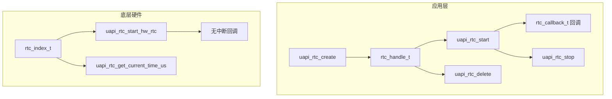
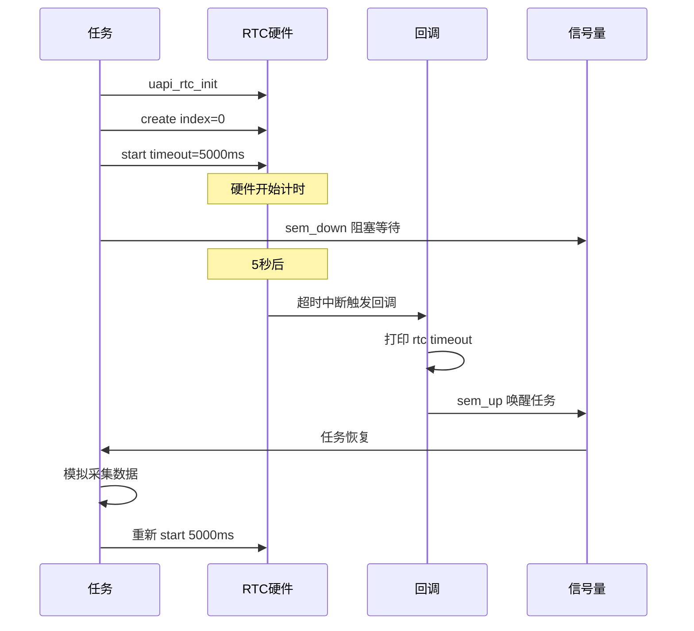

# RTC

> RTC (Real-Time Clock) 驱动 | 无 sample

## 学习目标

- 理解 RTC 的两种使用层次——应用级定时器（create/start/stop）和底层硬件定时器（start_hw_rtc）
- 掌握 `uapi_rtc_init -> create -> start -> callback` 的完整调用链
- 理解 RTC 的低功耗特性——系统休眠时独立运行，可用作休眠唤醒源

## 基本概念

### RTC 做什么

RTC是独立于系统主时钟的硬件定时器，由独立电源域供电。即使系统进入深度休眠（CPU 停时钟），RTC 继续运行，超时后通过中断唤醒 CPU。适用于：

- 低功耗间歇工作——定时唤醒传感器采集数据后继续休眠
- 精确延时——硬件定时器精度达 μs 级
- 长时间超时——`uapi_rtc_get_max_ms()` 查询最大延时，远超 OS (Operating System) Tick

### 两层架构



- **应用级**（create/start/stop）：封装了中断管理，超时自动回调；句柄可复用于启动/停止/删除
- **底层硬件**（start_hw_rtc）：直接操作硬件，**不处理中断**——仅用于计时；不能使用已被应用级占用的 index

### RTC 与 OS 定时器对比

| 对比项 | RTC | OS 软件定时器 |
|--------|:---:|:---:|
| 精度 | μs 级 | 取决于 OS Tick（通常 1ms） |
| 休眠可用 | 是 | 否——依赖调度器 |
| 中断上下文 | 硬件中断 | 任务上下文 |
| 最大延时 | `uapi_rtc_get_max_ms()` 返回 | 取决于定时器链表长度 |
| 同时存在数量 | 硬件 index 数量限制 | 仅受内存限制 |

## 涉及 API

| API | 用途 | 头文件 |
|-----|------|--------|
| `uapi_rtc_init(void)` | 初始化 RTC 模块 | `rtc.h` |
| `uapi_rtc_deinit(void)` | 去初始化 | `rtc.h` |
| `uapi_rtc_adapter(rtc_index_t index, uint32_t int_id, uint16_t int_priority)` | 适配底层 RTC（设置中断 ID 和优先级） | `rtc.h` |
| `uapi_rtc_create(rtc_index_t index, rtc_handle_t *rtc)` | 创建 RTC 定时器句柄 | `rtc.h` |
| `uapi_rtc_delete(rtc_handle_t rtc)` | 删除定时器 | `rtc.h` |
| `uapi_rtc_start(rtc_handle_t rtc, uint32_t rtc_ms, rtc_callback_t callback, uintptr_t data)` | 启动定时器 | `rtc.h` |
| `uapi_rtc_stop(rtc_handle_t rtc)` | 停止定时器（不会调用回调） | `rtc.h` |
| `uapi_rtc_get_max_ms(void)` | 获取最大可设置延时 | `rtc.h` |
| `uapi_rtc_get_current_time_us(rtc_index_t index, uint32_t *current_time_us)` | 获取当前计时值（μs） | `rtc.h` |
| `uapi_rtc_start_hw_rtc(rtc_index_t index, uint64_t rtc_ms)` | 启动底层硬件 RTC（无中断回调） | `rtc.h` |
| `uapi_rtc_stop_hw_rtc(rtc_index_t index)` | 停止底层硬件 RTC | `rtc.h` |
| `uapi_rtc_suspend(uintptr_t val)` / `uapi_rtc_resume(uintptr_t val)` | 低功耗挂起/恢复（需 `CONFIG_RTC_SUPPORT_LPM`） | `rtc.h` |

> 回调类型 `rtc_callback_t` 签名为 `void (*)(uintptr_t data)`——`data` 由 `uapi_rtc_start` 传入，可用于传递上下文。

## 案例说明

### 案例简介

创建 RTC 定时器，启动 5 秒单次超时，回调中打印超时信息并通过信号量通知任务。任务中实现间歇工作循环——RTC 超时后唤醒采集数据。

### 功能规格

| 规格项 | 说明 |
|--------|------|
| 定时器 index | RTC_INDEX_0 |
| 超时时间 | 5000ms（5 秒） |
| 模式 | 单次（start 一次触发一次回调） |
| 回调行为 | 打印 + 信号量通知任务 |
| 任务行为 | 等待信号量 → 模拟采集 → 重新启动 RTC |

程序运行流程：init → adapter → create → start → 5s → 回调触发 → 信号量唤醒任务 → 任务重新 start。

### 案例流程



## 案例操作指导

### 第一步：编译

```bash
fbb build [CHIP_NAME]-liteos-app
```

> 更多编译选项请参考 [构建操作](../../../overall-architecture/build-output/index.md#构建操作)。

### 第二步：烧录

```bash
fbb flash [CHIP_NAME]-liteos-app
```

> 更多烧录选项请参考 [构建操作](../../../overall-architecture/build-output/index.md#构建操作)。

### 第三步：预期输出

```text
RTC: init OK, max_timeout=60000ms
RTC: created handle=0x...
RTC: started, timeout=5000ms, waiting...
rtc timeout, tick=5000
collect data #1
rtc timeout, tick=10000
collect data #2
```

## 关键配置

| 参数 | 值 | 说明 |
|------|-----|------|
| index 选择 | 不重叠 | 应用级和底层硬件级不能共用同一 index |
| 回调耗时 | < 50μs | 回调在中断上下文执行 |
| 最大延时 | `uapi_rtc_get_max_ms()` | 取决于硬件计数器位宽 |
| start_hw_rtc | 无回调 | 仅用于计时——需自行轮询 `get_current_time_us` |
| 休眠唤醒 | CONFIG_RTC_SUPPORT_LPM | 启用后支持 `suspend`/`resume` |

### 单次 vs 周期

RTC 本身是**单次触发**——每次超时后自动停止。若要实现周期效果，在回调中重新调用 `uapi_rtc_start`。

| 方式 | 实现 | 适用 |
|------|------|------|
| 回调重启动 | 回调中再次 `start` | 精确周期（误差 < 10μs） |
| 任务重启动 | 任务收到信号量后 `start` | 宽松周期（误差取决于任务调度） |

## 代码详解

> 概念性代码，基于 SDK头文件 `rtc.h` 中的 API 签名。

```c
#include "rtc.h"
#include "errcode.h"
#include "osal_printk.h"
#include "osal_semaphore.h"
#include "app_init.h"

#define RTC_TIMEOUT_MS  5000

static rtc_handle_t g_rtc_handle;
static osal_semaphore g_rtc_sem;

/* RTC 超时回调——在中断上下文中执行 */
static void rtc_timeout_callback(uintptr_t data)
{
    (void)data;
    osal_printk("rtc timeout\n");
    osal_sem_up(&g_rtc_sem);  /* 非阻塞通知任务 */
}

/* 间歇工作任务 */
static int rtc_task_handler(void *data)
{
    (void)data;
    int count = 0;
    errcode_t ret;

    while (1) {
        osal_sem_down(&g_rtc_sem);  /* 等待 RTC 超时 */

        count++;
        osal_printk("collect data #%d\n", count);

        /* 重新启动 RTC 实现周期效果 */
        ret = uapi_rtc_start(g_rtc_handle, RTC_TIMEOUT_MS,
                             rtc_timeout_callback, 0);
        if (ret != ERRCODE_SUCC) {
            osal_printk("RTC restart failed: %d\n", ret);
        }
    }
    return 0;
}

static void rtc_entry(void)
{
    errcode_t ret;
    uint32_t max_ms;

    /* 初始化 RTC 模块 */
    ret = uapi_rtc_init();
    if (ret != ERRCODE_SUCC) {
        osal_printk("RTC init failed: %d\n", ret);
        return;
    }

    max_ms = uapi_rtc_get_max_ms();
    osal_printk("RTC: init OK, max_timeout=%ums\n", max_ms);

    /* 适配底层 RTC（设置中断 ID 和优先级） */
    ret = uapi_rtc_adapter(RTC_INDEX_0, RTC_IRQ_ID, RTC_IRQ_PRIO);
    if (ret != ERRCODE_SUCC) {
        osal_printk("RTC adapter failed: %d\n", ret);
        return;
    }

    /* 创建定时器句柄 */
    ret = uapi_rtc_create(RTC_INDEX_0, &g_rtc_handle);
    if (ret != ERRCODE_SUCC) {
        osal_printk("RTC create failed: %d\n", ret);
        return;
    }
    osal_printk("RTC: created handle=%p\n", g_rtc_handle);

    /* 初始化信号量 */
    osal_sem_init(&g_rtc_sem, 0);

    /* 启动定时器——5 秒后触发回调 */
    ret = uapi_rtc_start(g_rtc_handle, RTC_TIMEOUT_MS,
                         rtc_timeout_callback, 0);
    if (ret != ERRCODE_SUCC) {
        osal_printk("RTC start failed: %d\n", ret);
        return;
    }
    osal_printk("RTC: started, timeout=%ums, waiting...\n", RTC_TIMEOUT_MS);

    /* 创建任务等待 RTC 超时 */
    osal_task *task = osal_kthread_create(
        (osal_kthread_handler)rtc_task_handler,
        NULL, "RtcTask", 4096);
    osal_kthread_set_priority(task, OSAL_TASK_PRIORITY_HIGH);
}

app_run(rtc_entry);
```

> 底层硬件 RTC（`uapi_rtc_start_hw_rtc`）直接操作硬件计数器，不经过中断子系统——适用于不需要回调的纯计时场景。使用后需通过 `uapi_rtc_get_current_time_us` 轮询时间。

---

