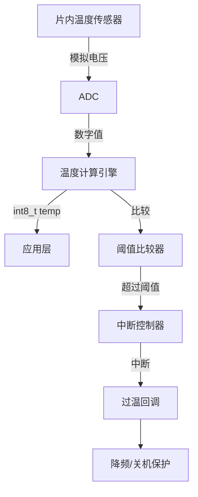
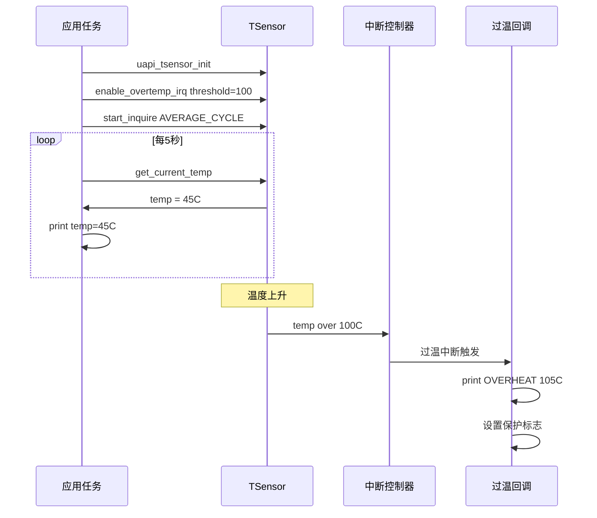

# TSensor

> TSensor 驱动 | 无 sample

## 学习目标

- 理解片内温度传感器的作用——监测芯片结温，实现过热保护
- 掌握 3 种采样模式：平均单次、平均循环、单点循环
- 掌握过温中断配置——硬件自动触发保护回调
- 能够在 [CHIP_NAME] 上实现温度周期性采集和过温自动保护

## 基本概念

### TSensor 做什么

TSensor 是集成在芯片内部的温度传感器，直接测量芯片结温。温度范围 **-40°C ~ +125°C**。核心用途：

- **温度监控**：周期性读取当前温度，评估芯片热状态
- **过热保护**：配置过温阈值，硬件自动触发中断——用于降频/关机保护
- **温度补偿**：为 RF/RTC 等温度敏感模块提供校准基准



### 3 种采样模式

| 模式 | 枚举值 | 行为 | 适用 |
|------|------|------|------|
| 平均单次 | `TSENSOR_SAMP_MODE_AVERAGE_ONCE` | 采集 16 个点取平均，上报一次后停止 | 一次性温度快照 |
| 平均循环 | `TSENSOR_SAMP_MODE_AVERAGE_CYCLE` | 16 点平均，持续周期性上报 | 持续温度监控（推荐） |
| 单点循环 | `TSENSOR_SAMP_MODE_SINGLE_POINT_CYCLE` | 单点采样，持续周期性上报 | 快速响应温度变化 |

### 中断类型

| 中断 | API | 触发条件 |
|------|-----|------|
| 过温中断 | `uapi_tsensor_enable_overtemp_interrupt` | 温度超过 `overtemp` 阈值 |
| 越界中断 | `uapi_tsensor_enable_outtemp_interrupt` | 温度超出 [low, high] 区间 |
| 采集完成中断 | `uapi_tsensor_enable_done_interrupt` | 每次采样完成时触发 |

### 典型温度阈值

| 等级 | 阈值 | 建议动作 |
|------|:---:|------|
| 正常 | < 85°C | 正常工作 |
| 警告 | 85°C | 减少 RF (Radio Frequency) 发射功率 |
| 降频 | 100°C | 降低 CPU 频率 |
| 关机 | 115°C | 紧急关闭 RF/WiFi/BT |

## 涉及 API

| API | 用途 | 头文件 |
|-----|------|--------|
| `uapi_tsensor_init(void)` | 初始化 TSensor 模块 | `tsensor.h` |
| `uapi_tsensor_deinit(void)` | 去初始化 | `tsensor.h` |
| `uapi_tsensor_start_inquire_mode(tsensor_samp_mode_t mode, uint32_t period)` | 启动采样模式 | `tsensor.h` |
| `uapi_tsensor_get_current_temp(int8_t *temp)` | 获取当前温度值 | `tsensor.h` |
| `uapi_tsensor_enable_overtemp_interrupt(uapi_tsensor_callback_t callback, int8_t overtemp)` | 使能过温中断 | `tsensor.h` |
| `uapi_tsensor_enable_outtemp_interrupt(uapi_tsensor_callback_t callback, int8_t temp_threshold_low, int8_t temp_threshold_high)` | 使能越界中断 | `tsensor.h` |
| `uapi_tsensor_enable_done_interrupt(uapi_tsensor_callback_t callback)` | 使能采样完成中断 | `tsensor.h` |
| `uapi_tsensor_set_calibration_single_point(tsensor_calibration_point_t *point)` | 单点温度校准（需 `CONFIG_TSENSOR_TEMP_COMPENSATION`） | `tsensor.h` |
| `uapi_tsensor_set_calibration_two_points(const tsensor_calibration_point_t *point_first, const tsensor_calibration_point_t *point_second)` | 两点温度校准 | `tsensor.h` |
| `uapi_tsensor_set_multilevel_threshold_value(tsensor_multilevel_value_t level, int16_t temp)` | 多级温度阈值设置（需 `CONFIG_TSENSOR_MULTILEVEL`） | `tsensor.h` |

> 回调类型 `uapi_tsensor_callback_t` 签名为 `errcode_t (*)(int8_t temp)`——回调接收当前温度值，可据此决策。

## 案例说明

### 案例简介

启动平均循环采样模式，注册过温中断（阈值 100°C）。主循环每 5 秒读取一次当前温度并打印，过温时回调触发紧急保护。

### 功能规格

| 规格项 | 说明 |
|--------|------|
| 采样模式 | 平均循环（16 点平均） |
| 采样周期 | 由 `start_inquire_mode` 参数设定 |
| 读取周期 | 每 5 秒 `get_current_temp` |
| 过温阈值 | 100°C |
| 过温回调 | 打印告警 + 设置保护标志 |

程序运行流程：init → enable_overtemp_irq(100°C) → start_inquire → 循环 { get_temp, print, sleep 5s } → 温度超 100°C → 过温回调触发。

### 案例流程



## 案例操作指导

### 第一步：编译

```bash
fbb build [CHIP_NAME]-liteos-app
```

> 更多编译选项请参考 [构建操作](../../../overall-architecture/build-output/index.md#构建操作)。

### 第二步：烧录

```bash
fbb flash [CHIP_NAME]-liteos-app
```

> 更多烧录选项请参考 [构建操作](../../../overall-architecture/build-output/index.md#构建操作)。

### 第三步：预期输出

```text
TSensor: init OK
TSensor: overtemp IRQ enabled, threshold=100C
TSensor: sample mode=AVERAGE_CYCLE started
temp: 42C
temp: 43C
...
temp: 98C
temp: 101C
OVERHEAT! Current temp=105C, entering protection mode!
```

## 关键配置

| 参数 | 值 | 说明 |
|------|-----|------|
| 温度范围 | -40°C ~ +125°C | 超出范围值无效 |
| 过温阈值 | 100°C（降频）/ 115°C（关机） | 根据散热条件调整 |
| 采样周期 | 由硬件能力决定 | 不宜过快——温度变化是慢变量 |
| 校准 | 可选单点/两点 | 生产阶段进行，修正传感器偏差 |
| 多级阈值 | 需 `CONFIG_TSENSOR_MULTILEVEL` | 多个温度阶梯触发不同保护等级 |

### 过温 vs 越界中断选择

| 场景 | 推荐中断 | 原因 |
|------|:---:|------|
| 只需监控上限 | 过温中断 | 简单直接 |
| 需监控高低温区间 | 越界中断 | 同时覆盖上下限 |
| 需周期性读取温度 | 采样完成中断 | 硬件采样完成即通知 |

## 代码详解

> 概念性代码，基于 SDK头文件 `tsensor.h` 中的 API 签名。

```c
#include "tsensor.h"
#include "errcode.h"
#include "osal_printk.h"
#include "app_init.h"

#define OVERTEMP_THRESHOLD  100   /* 过温阈值 100°C */
#define TEMP_READ_PERIOD_MS 5000  /* 温度读取周期 5 秒 */

static volatile bool g_overheat_flag = false;
static int8_t g_overheat_temp = 0;

/* 过温中断回调 */
static errcode_t overtemp_callback(int8_t temp)
{
    g_overheat_flag = true;
    g_overheat_temp = temp;
    osal_printk("OVERHEAT! Current temp=%dC, entering protection mode!\n", temp);
    /* 实际应用中：降频、关闭 RF 等保护操作 */
    return ERRCODE_SUCC;
}

static void tsensor_entry(void)
{
    errcode_t ret;
    int8_t current_temp = 0;

    /* 初始化 TSensor */
    ret = uapi_tsensor_init();
    if (ret != ERRCODE_SUCC) {
        osal_printk("TSensor init failed: %d\n", ret);
        return;
    }
    osal_printk("TSensor: init OK\n");

    /* 使能过温中断——温度超过 100°C 触发 */
    ret = uapi_tsensor_enable_overtemp_interrupt(overtemp_callback,
                                                  OVERTEMP_THRESHOLD);
    if (ret != ERRCODE_SUCC) {
        osal_printk("TSensor overtemp IRQ failed: %d\n", ret);
        return;
    }
    osal_printk("TSensor: overtemp IRQ enabled, threshold=%dC\n",
                OVERTEMP_THRESHOLD);

    /* 启动平均循环采样模式 */
    ret = uapi_tsensor_start_inquire_mode(TSENSOR_SAMP_MODE_AVERAGE_CYCLE, 0);
    if (ret != ERRCODE_SUCC) {
        osal_printk("TSensor start inquire failed: %d\n", ret);
        return;
    }
    osal_printk("TSensor: sample mode=AVERAGE_CYCLE started\n");

    /* 主循环：周期性读取温度 */
    while (1) {
        /* 检查过温标志 */
        if (g_overheat_flag) {
            osal_printk("Protection mode active, peak temp=%dC\n",
                        g_overheat_temp);
            g_overheat_flag = false;
            /* 温度回落后可清除标志恢复正常 */
        }

        /* 读取当前温度 */
        ret = uapi_tsensor_get_current_temp(&current_temp);
        if (ret == ERRCODE_SUCC) {
            osal_printk("temp: %dC\n", current_temp);
        } else {
            osal_printk("TSensor read failed: %d\n", ret);
        }

        osal_msleep(TEMP_READ_PERIOD_MS);
    }
}

app_run(tsensor_entry);
```

> 过温回调在**硬件中断上下文**中执行——不可阻塞、不可长时间运行。仅设置标志或发信号量，保护逻辑由任务完成。

---

